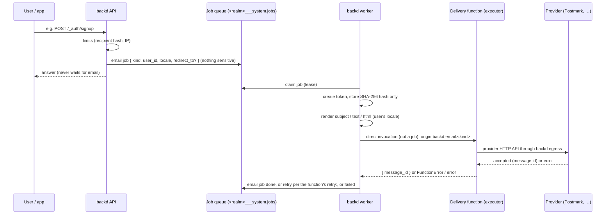

# Design: email delivery through functions

- **Issues:** design 4.1b (#6) → features 4.2c (retries), 4.2e (localization), 4.2 (send email, #9), 4.2b (Postmark, #10), 4.2d (dev tooling), 4.2f (hosted pages), 4.2g (custom emails)
- **Status:** decided
- **Related designs:** [internal-functions.md](./internal-functions.md) (the delivery function is internal), [account-lifecycle.md](./account-lifecycle.md) (the flows that send these emails)

## 1. The idea

**Use any email provider. All you write is one function with a simple contract.**

backd never talks to a mail server. Each realm names one **delivery function**: an internal, async function that receives a finished message and hands it to whatever provider the developer chose (Postmark, SES, Resend, Mailgun, SendGrid, …). backd does everything else: templates, languages, tokens and links, retries, abuse limits, and the pages users land on.

## 2. Decisions at a glance

| Topic | Decision |
|---|---|
| Who sends | a realm-named delivery function (`internal: true`, `mode: async`); no SMTP, no sending by backd |
| Content | backd renders per-realm templates **and** passes `kind` and `data`, so providers' own templates can be used |
| Default templates | written by `backd template realm`, English, editable; required kinds must exist |
| Template loading | parsed and checked at startup, held in memory, part of the config fingerprint |
| Languages | `user.locale`; `email.default_locale` and `email.locales`; every listed locale fully translated |
| Queue | each email is a small backd **email job** (`kind`, `user_id`, `locale`, `redirect_to`); the worker calls the delivery function **directly**, so the message is never stored |
| Tokens in links | created at send time by the worker; only the SHA-256 hash is stored |
| Retries | a general `retry:` option for async functions; `FunctionError` (4xx) is permanent |
| Abuse limits | per recipient (hashed) and per IP, shared via `<realm>___system`; silent for anonymous endpoints, `429` for authenticated ones; custom emails add caps per function, per call and per invocation (§11) |
| Transport | HTTP-API providers through the egress proxy; SMTP is backlog (7.32) |
| Scope | transactional email only; deliverability (domain authentication, reputation, bounces, complaints) is the sender's responsibility, documented |
| Links | built from `BACKD_URL`, pointing at backd's own **hosted pages**; per-kind override to app pages |
| After the click | hosted pages redirect to the developer's URL after a short delay |
| Custom emails | `ctx.email.send()` for functions declaring `email: true`; **any recipient** (users or addresses), message text only from realm templates; bounded by caps, not by who (§12) |
| Development | `email-capture` function, `dev_only:` key, a Mailbox app, `fakeEmail()` |
| Not configured | a realm without `email:` behaves as today |

## 3. Flow



**Why the worker calls the function directly.** A function's input is stored with its job until the job expires. The message holds the token link, so delivery must not be an ordinary async job. The queued record is a small backd system job (the **email job**) that holds only `kind`, `user_id`, `locale` and `redirect_to`. The worker creates the token, renders the message in memory and invokes the delivery function on the executor, without creating a job for that call. The message exists only in memory and at the provider; backd keeps no copy.

**What an email job records:** status, attempts, next attempt time, the delivery function's `message_id`, and the final failure code. The admin jobs list shows email jobs with the delivery function as `function` and `origin: backd:email.<kind>`; it never shows a message, a link or an address. Retention follows `job_retention`.

## 4. Configuration (`realm.yaml`)

The `realm.yaml` written by `backd template realm` contains this section **commented**, explaining every key, the language fallback rule, where templates live and how to add a language.

```yaml
email:
  function: notifications/deliver        # <database>/<function>; must be internal: true and mode: async
  from: "Acme <no-reply@acme.example>"
  reply_to: "support@acme.example"       # optional
  public_url: https://api.acme.example   # optional; overrides BACKD_URL for this realm's links
  default_locale: en                     # must be in locales
  locales: [en, es]                      # every listed locale needs every required template
  redirect_delay: 3s                     # hosted pages: wait before redirecting
  redirects:                             # where hosted pages send users afterwards
    verify_email:   https://app.acme.example/welcome
    reset_password: https://app.acme.example/login
    change_email:   https://app.acme.example/account
    invitation:     https://app.acme.example/welcome
  allowed_redirects:                     # origins and app schemes allowed for redirect_to and links
    - https://app.acme.example
    - https://admin.acme.example
    - acme://
  links: {}                              # optional per-kind override, e.g. reset_password: "https://app.acme.example/reset?token={token}"
  limits:                                # (defaults shown)
    per_recipient: { per_kind_per_hour: 3, per_day: 10 }
    per_ip: { per_hour: 20 }
    per_function: { per_hour: 200, per_invocation: 50 }   # custom emails from functions (§12)
    recipients_per_message: 10                            # to + cc + bcc of one ctx.email.send()
```

- **`BACKD_URL`** (today CLI-only) also becomes backd's public address on `serve` and `worker`. Startup fails if a realm has `email:` and neither `BACKD_URL` nor `email.public_url` is set.
- **Without an `email:` section** the realm behaves as today: email endpoints don't exist (`404`), sign-up keeps `409 email_taken`, and settings that need email (`require_verified_email`, `allow_email_change`, `welcome_email`, invitation emails) fail startup.

**Startup checks:** the named function exists, is `internal: true` and `mode: async`; `from` is a valid address; `default_locale ∈ locales`; every required template exists for every listed locale and parses; every page template exists and parses; `redirects`, `links` and `public_url` are absolute URLs; every `redirects` and `links` value is within `allowed_redirects`.

## 5. The delivery function contract

**Input** (`ctx.input`):

```js
{
  id: "d3c9ljp8hc2g00b6s1m0",           // stable per email, the same on every retry
  kind: "verify-email",                 // system kind or custom kind
  from: "Acme <no-reply@acme.example>",
  reply_to: "support@acme.example",     // or null
  to:  [{ email: "ana@example.com", name: null }],
  cc:  [], bcc: [],                     // only custom emails from functions use them
  subject: "Confirm your email",
  text: "…",                            // rendered by backd
  html: "…",                            // rendered by backd
  locale: "en",
  data: { link: "https://…", expires_at: "…" }   // for providers' own templates
}
```

**Output:** `{ message_id?: string }` — stored on the email job.

**`id`** is the email job's id and is identical on every retry. A provider with idempotency keys (Resend's `Idempotency-Key`, for example) can use it to drop a repeat when the first attempt reached the provider but its answer was lost; providers without the feature ignore it.

**Failure:**
- throw `FunctionError` (4xx, e.g. the provider rejected the address) → **permanent**, no retry;
- anything else (thrown error, timeout, provider unreachable) → **retried** per the function's `retry:`.

**Function requirements:** `internal: true`, `mode: async` (async limits and timeouts apply, and nothing ever waits for it in a request path); typically `secrets: [PROVIDER_TOKEN]` and `network: [<provider host>]`. Tokens and links in the input are masked in the function's log output, like secrets.

A minimal function (the Postmark example of 4.2b follows this shape):

```js
export default async function deliver(ctx) {
  const m = ctx.input;
  const res = await fetch("https://api.postmarkapp.com/email", {
    method: "POST",
    headers: { "X-Postmark-Server-Token": ctx.secrets.POSTMARK_TOKEN, "Content-Type": "application/json", "Accept": "application/json" },
    body: JSON.stringify({ From: m.from, To: m.to.map(t => t.email).join(","), Subject: m.subject, TextBody: m.text, HtmlBody: m.html, ReplyTo: m.reply_to ?? undefined }),
  });
  if (res.status === 422) throw new FunctionError(422, "rejected", "Provider rejected the message");
  if (!res.ok) throw new Error(`provider answered ${res.status}`);   // retried
  return { message_id: (await res.json()).MessageID };
}
```

## 6. Templates

**Layout** — one folder per kind, one file set per locale:

```
<realm>/email/
  welcome/          en.subject.txt  en.txt  en.html
  verify-email/     en.subject.txt  en.txt  en.html
  reset-password/   …
  change-email/     …
  email-changed/    …
  account-exists/   …
  password-changed/ …
  invitation/       …
  <custom-kind>/    …          # for ctx.email.send()
```

- **Required kinds** (when `email:` is configured): `verify-email`, `reset-password`, `account-exists`, `password-changed`. Required when their feature is enabled: `welcome` (`welcome_email`), `change-email` and `email-changed` (`allow_email_change`, or admin email changes), `invitation` (invitation emails). Custom kinds are required when a function referencing them exists Functions declare the kinds they send in `function.yaml` (`email: { kinds: [...] }`), so startup can check the templates; kind names can't collide with system kinds.
- **Engine:** Go `text/template` for subject and text, `html/template` (auto-escaping) for HTML.
- **Data**: `{{.Realm}}`, `{{.User.Email}}`, `{{.User.Locale}}`, `{{.Link}}` (token kinds), `{{.ExpiresAt}}`, `{{.Data}}` (custom kinds). Templates never receive text written by the requester, so backd can't be used as an open relay.
- Parsed and checked at startup, held in memory, included in the config fingerprint. `backd template realm` writes English defaults for every kind; the developer edits them freely.

## 7. Languages

- Users have `locale` (BCP 47, e.g. `es`, `es-MX`). Every email to a user uses it.
- **At sign-up** the locale comes from the request's `locale` field (the JS client can send the browser's language) or `Accept-Language`, and is mapped silently to the best listed value: exact (`es-MX`) → language (`es`) → `default_locale`. `user.locale` is always a listed value.
- **Explicit change** through `PATCH /_auth/me {locale}`: an unlisted locale answers `400 invalid_locale` with the allowed list in `details`.
- **Every listed locale must have every required template** (startup fails naming the missing files), so "allowed" means "fully translated".
- Undeclared `email:` locales behave as `default_locale: en`, `locales: [en]`. Shipped defaults are English only.

## 8. Tokens

- The job holds only `{ kind, user_id, locale, redirect_to? }`; nothing that works as a credential is ever stored.
- At send time the worker creates a 256-bit random token, stores **only its SHA-256 hash** with `purpose`, `user_id`, `expires_at`, `used_at` and `redirect_to`, renders the link and calls the delivery function. The plain token exists only in memory and in the message given to the provider.
- **The hash is all backd needs afterwards:** redemption hashes the presented token, looks it up, checks purpose, expiry and use, and marks it used in **one atomic update** (two parallel redemptions: exactly one succeeds). Success invalidates the user's other outstanding tokens of the same purpose.
- A retry creates a new token; earlier undelivered tokens simply expire.
- Lifetimes and purposes are defined in [account-lifecycle.md](./account-lifecycle.md).

## 9. Retries for async functions (issue 4.2c, general)

```yaml
retry:
  attempts: 5        # total attempts including the first; default 1 (no retry)
  backoff: 1m        # waits 1m, 2m, 4m, … (exponential)
  max_backoff: 1h    # cap on a single wait
```

- Available to **every** async function (and cron runs).
- `FunctionError` (4xx) → permanent failure, no further attempts. Anything else → next attempt after the backoff.
- Each attempt is its own invocation in history; the job records the attempt count and next attempt time; leases work as today.
- Applies to ordinary async jobs (the stored input is reused) and to **email jobs** (each attempt creates a new token and renders again).
- After the last attempt the job is `failed`, logged (for email: without address or token) and listed by the job list.
- The delivery function template ships with `attempts: 5, backoff: 1m`.

## 10. Links and hosted pages (issue 4.2f)

**Links** in emails point at backd:

```
{public_url}/v1/{realm}/_auth/verify-email?token=…
{public_url}/v1/{realm}/_auth/reset-password?token=…
{public_url}/v1/{realm}/_auth/confirm-email-change?token=…
{public_url}/v1/{realm}/_auth/revert-email-change?token=…
{public_url}/v1/{realm}/_auth/accept-invitation?token=…
```

**Two steps, so mail scanners can't use up tokens:** a **GET** only shows the page (a button, or a form); the **POST** from that page performs the action. Mail security scanners open links but don't submit forms.

**After success** the result page redirects after `redirect_delay` to:
1. the `redirect_to` stored with the token hash (it was sent with the request that caused the email and checked against `allowed_redirects`; a value outside the list answers `400 invalid_redirect`); otherwise
2. `email.redirects.<kind>`; otherwise
3. no redirect (the page just shows success).

`redirect_to` is never part of the link, so a link can't be edited to point anywhere else. App schemes (`acme://`) let mobile apps get users back into the app.

**Hosted pages never issue sessions** (no token in a redirect URL). Users sign in afterwards.

**Every hosted page:**
- keeps the query string out of the access log for these routes;
- sends `Referrer-Policy: no-referrer`, `Cache-Control: no-store`, a strict `Content-Security-Policy` with `frame-ancestors 'none'`;
- loads no external resources;
- shows the **same** error page for expired, used and unknown tokens, with a link back to the app.

The single-use token in the form protects it like a CSRF token; nothing else is needed.

**Page templates** use the same system as emails: `<realm>/pages/<kind>/<locale>.html` for `verify-email`, `reset-password`, `confirm-email-change`, `revert-email-change`, `accept-invitation` and `result`; written by `backd template realm`, localized (user's locale), checked at startup.

**Per-kind override:** `links.<kind>: "https://app.acme.example/reset?token={token}"` sends that kind's link to an app page instead (must be within `allowed_redirects`). The app then calls the JSON endpoint with **POST**. The docs state the rule: **hosted pages are opened by a person with GET from the email; your own pages call backd with POST** sending the token and whatever else is needed (e.g. the new password).

**JSON endpoints** (same logic as the hosted pages): `POST /_auth/verify-email {token}`, `POST /_auth/reset-password {token, password}`, `POST /_auth/confirm-email-change {token}`, `POST /_auth/revert-email-change {token}`, `POST /_auth/accept-invitation {token, password, locale?}`. Invalid, expired or used tokens answer `400 invalid_token` (one code for all three).

## 11. Abuse limits

- **Per recipient:** 3 emails of the same kind per hour, 10 in total per day. **Per IP:** 20 email-sending requests per hour. Configurable under `email.limits`.
- Counters live in `<realm>___system.login_attempts` (the existing counters collection; TTL expiry), keyed `email:to:<sha256(normalized address)>` and `email:ip:<ip or IPv6 /64>` — no address is stored readable. **Accepted risk:** an unsalted hash of an address can be tested against a known address by someone who can read the database; the counters expire within a day and carry no other data.
- **Endpoints without login** (sign-up, reset request, resend verification by email) give the same answer and **skip silently** over the limit. **Endpoints with login** answer `429` with `Retry-After`. Skipped sends are logged without the address.
- `ctx.email.send()` counts against the per-recipient limits too, and has caps of its own that bound the damage of a badly guarded function, whoever the recipients are: **per function** (`per_function.per_hour`, default 200, all of its sends in the realm), **per invocation** (`per_invocation`, default 50, which stops loops) and **per message** (`recipients_per_message`, default 10, counting `to`, `cc` and `bcc`). Over a cap the call throws (§12); nothing is queued.

## 12. Custom emails from functions (issue 4.2g)

*Revised 2026-10-02: the `external_recipients` flag is gone. Any function that declares `email: true` may address any recipient; the controls below bound what a badly guarded function can do instead of restricting who it may write to.*

```js
await ctx.email.send({ to_user: order.owner, kind: 'order-shipped', data: { order_no: order.no } });
await ctx.email.send({ to: [order.customer_email], kind: 'invoice', data: { invoice_no: order.invoice } });
```

- Requires `email: true` in `function.yaml`; custom kinds have templates in `<realm>/email/<kind>/`, checked at startup. The invocation's callback credentials carry the capability; `ctx.email.send()` calls backd on the internal listener, which checks it.
- **Recipients: anyone.** `to_user` (a realm user's id, resolved by backd, rendered in that user's locale) **or** `to`, plus optional `cc` and `bcc`, as arrays of addresses (rendered in `default_locale` unless a `locale` is given). Limiting by recipient would forbid ordinary uses (an invoice to the address on an order, a contact form to the shop's own mailbox) and wouldn't address the real risk, which is a function that sends mail **without control**.
- **Text: only the realm's templates.** A function chooses a `kind` and supplies `data`; it never supplies a subject or a body. `data` is free text, though, and a template that prints it is a message the caller of the function can write: that is the phishing vector (§15).
- **Caps that don't depend on who** (§11): per recipient (shared with the account emails), per function per hour, per invocation, and recipients per message. Over a cap, `ctx.email.send()` throws an `EmailLimitError` (`code: "email_limited"`, with `retry_after`) and queues nothing: unlike account endpoints, the function has the information and decides what to answer.
- **Visibility:** each send is an email job with `origin: function:<database>/<name>` and its `kind`, in the job list; the admin API shows send counts per function; startup logs which functions can send email. Addresses are never logged or audited.
- **What the queue holds** differs from the account emails: with no user to look up, an email job from a function stores the recipients' addresses and the `data` it was given, for as long as jobs are retained (`functions.job_retention`). Don't put secrets in `data`. The docs say so.
- Goes through the same queue, delivery function and retries. Returns the job handle.

## 13. Development and tests (issue 4.2d)

- **`dev_only: true`** — a new general `function.yaml` key: startup **refuses** the function unless `BACKD_DEV=true`.
- **`email-capture`** — a delivery function written by `backd template`: internal, async, `dev_only: true`; stores each rendered message (links included) in an `outbox` collection of the same database (schema and rules included).
- **Mailbox** — a small web app in the local stack listing `outbox` (to, subject, time) and showing text and HTML with working links, to click through verification and reset by hand.
- Integration tests read links from `outbox`; `@backd/functions-testing` gets `fakeEmail()` for unit tests of functions using `ctx.email.send()`.

## 14. Scope and the sender's responsibility

- **Transactional email only:** account emails and the custom emails a function sends on an event. No attachments, newsletters, marketing or unsubscribe handling.
- **backd sends nothing from its own servers or addresses.** The delivery function sends through the developer's own provider account and domain, so sender reputation, domain authentication (SPF, DKIM, DMARC), sending volume, bounce and complaint handling and suppression lists are the **sender's responsibility**. backd does not read bounces or complaints and has no webhook for them; the provider's dashboard and rules do that.
- A function that sends email is **the developer's code sending from the developer's domain**: if it can be made to mail people without control (an open endpoint that takes the recipient or the text from the request), the sender can be listed as a spam source and the provider may suspend the account. backd bounds the damage (§11, §12) but can't tell a legitimate send from an abusive one. The docs say so prominently (§16).
- What backd does to help: it limits how often one address or IP can trigger an email (§11), reports an immediate rejection by the provider as a permanent failure (no retries), and the docs say what to set up before going live (§16).

## 15. Security considerations

- backd never stores a working token or link; only hashes.
- **Account emails:** no requester-written text in templates → no open relay.
- **Custom emails:** a function's `data` can carry requester-written text, and its recipients can be any address, so a function that is reachable by anyone and passes request input into `to` or `data` is an open relay and a phishing tool from the realm's sender domain. backd can't prevent that without forbidding legitimate uses; it bounds it (per function, per invocation, per message and per recipient caps, `email_limited` errors) and makes it visible (§12). The responsibility is the function author's, and the docs state it as a danger, with a checklist.
- Per-recipient limits protect people; per-IP limits protect sender reputation and quota.
- The delivery function is internal, has only its declared secrets and network host, and its output is masked.
- Hosted pages: no token leaks (logs, referer, cache), no framing, no external resources, uniform errors, no sessions.
- Redirects only to declared origins; `redirect_to` bound to the token, not the link.
- `dev_only` makes it impossible to run the capture function (which stores links) in production.
- The message exists only in memory and at the provider; the email job and the invocation history never contain it.

## 16. Documentation

- "Email" guide: the any-provider principle, the delivery contract, configuration with every key, templates and data, languages, links and hosted pages (GET vs POST rule), limits, custom emails, local development with the Mailbox.
- Cookbook: Postmark (4.2b) step by step, plus a short list of other HTTP-API providers.
- `function.yaml` reference: `retry`, `dev_only`, `email`.
- Configuration reference: `BACKD_URL` on the server.
- Security model page: tokens, hosted pages, limits.
- `api/openapi.yaml`: every new endpoint and code (`invalid_token`, `invalid_locale`, `invalid_redirect`).
- Why no SMTP (and that most SMTP providers also offer HTTP APIs).
- **"Sending email from functions"**: a `danger` callout and checklist on the Email page: it is a spam relay if misused. Authenticate callers (an `invoke:` rule requiring `user.email_verified`, for example); never take the recipient from request input; never put requester-written text in `data` or print it in a template; add idempotency and rate limits to the function; use a verified sending domain and watch the provider's bounce and complaint rates; test with `email-capture`. Plus a contact-form example that shows the safe shape (fixed recipient, fixed kind).
- **"Before you send real email"**: a short checklist stating that deliverability is the sender's responsibility: authenticate the sending domain (SPF, DKIM, DMARC), use a dedicated sender address, watch the provider's bounce and complaint rates, keep the provider's suppression list on, and test with `email-capture` first.

## 17. Acceptance criteria by issue

**4.2c — retries:** `retry:` on async functions and cron; permanent vs retryable; attempts in history; `failed` after the last attempt. Tests for each path.

**4.2e — localization:** `user.locale`; sign-up mapping; `PATCH /_auth/me` with `400 invalid_locale`; `default_locale`/`locales` checks; template completeness check. Tests.

**4.2 — send email:** `email:` config and startup checks; delivery contract; rendering from memory; tokens created at send time with hash-only storage and atomic redemption; limits with hashed keys; `BACKD_URL`; realms without email unchanged; tests with `email-capture` asserting the database never contains a token.

**4.2b — Postmark example:** the function in the example realm, secrets and `network` limited to Postmark; cookbook page as the model for other providers.

**4.2d — dev tooling:** `dev_only` refused outside dev mode (tested); `email-capture`; Mailbox in the local stack; `fakeEmail()`.

**4.2f — hosted pages:** GET/POST pages for every token kind; security headers and log scrubbing (tested); uniform error page; redirects with `redirect_to` stored with the hash and checked against `allowed_redirects` (`400 invalid_redirect`); per-kind `links` override; JSON endpoints; page templates and localization.

**4.2g — custom emails:** `ctx.email.send()` with `email: true` and any recipient (no `external_recipients`); text only from templates; custom kinds checked at startup; caps (per function, per invocation, per message) and the per-recipient limits applied, `email_limited` thrown; jobs visible with their origin and kind, send counts per function in the admin API; `fakeEmail()` enforcing the caps; the docs' danger callout and checklist; tests with fakes and `email-capture`.

## 18. Alternatives considered

- **backd renders only / function renders only:** chose both, so defaults work and provider templates remain possible.
- **Templates copied into the database:** rejected; startup loading into memory gives the same speed without drift, and keeps templates in the config fingerprint.
- **Locale per request only, or per realm only:** chose stored `user.locale` so later emails (cron, admin) use the right language.
- **Encrypting job input / short retention:** rejected; tokens are created at send time instead.
- **Delivery function as an ordinary async job:** rejected; its input (the message with the link) would be stored with the job. The worker calls it directly and keeps an email job without content.
- **Handling bounces and complaints in backd:** rejected; backd doesn't send from its own IPs, so reputation is the sender's, handled with their provider.
- **Keyed hash for limit counters:** not needed for counters that expire within a day; the risk is documented.
- **Email-only retries / no retries:** chose a general `retry:`.
- **Limits at the proxy only, or per recipient only:** chose both, in backd.
- **Built-in SMTP or SMTP through egress:** rejected for configuration and deliverability burden and egress bypass; backlog 7.32 if demand appears.
- **Mailpit for development:** not now; the capture function and Mailbox reuse what exists.
- **Links to app pages chosen by the request `Origin`, or full return URLs from clients:** replaced by hosted pages built from `BACKD_URL` plus declared redirects.

## 19. Follow-ups

- 7.32 SMTP delivery, only with real demand.
- Mailpit in the local stack, if a friendlier mailbox is wanted.
