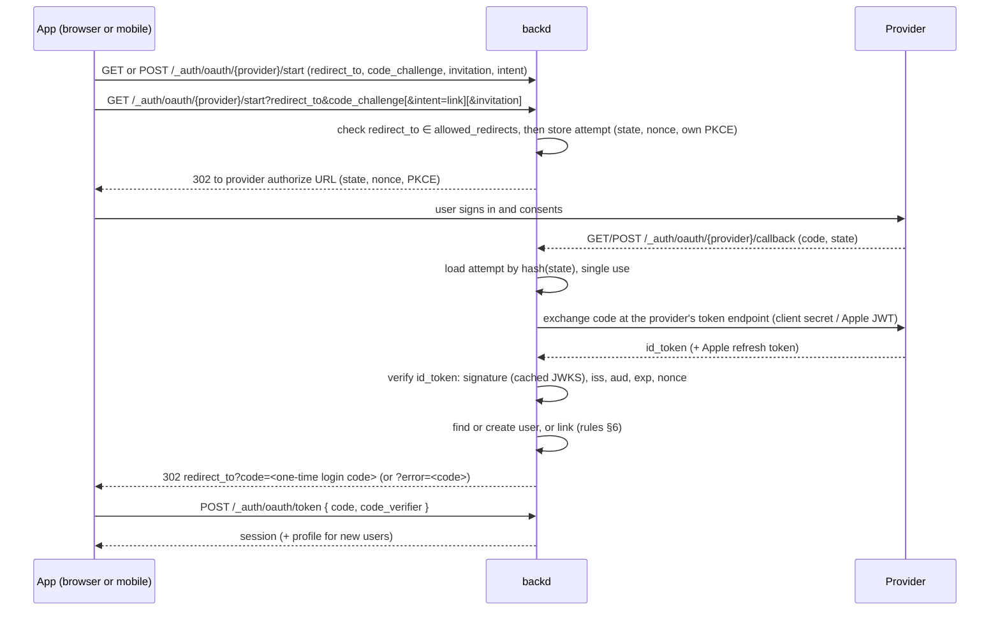

# Design: sign in with external identity providers

- **Issues:** #141 (this design) → #214 (several sign-in methods per user), #142 (Google, Microsoft, Apple), #143 (native ID tokens), #144 (Apple revocation), #145 (profile handover, `account.on_signup`), #146 (JS client), #215 (identities in the admin API, CLI and UI), #216 (integration testing guide), #157 (generic OpenID Connect), #158 (hosted sign-in page); supersedes #36
- **Status:** decided
- **Testing with real providers:** [identity-providers-testing.md](./identity-providers-testing.md)
- **Related designs:** [account-lifecycle.md](./account-lifecycle.md) (verification, erasure, sign-up modes), [email-delivery.md](./email-delivery.md) (hosted pages, templates, `allowed_redirects`, `BACKD_URL`), [internal-functions.md](./internal-functions.md) (`account.on_signup`)

## 1. Why, and what already exists

Users want "Continue with Google / Microsoft / Apple". backd was built for this: a user holds no credentials, each sign-in method is an `identities` document `{ user_id, provider, subject, … }` unique on `(provider, subject)`, passwords are just `provider: "password"`, and `users.email` is a sparse unique index. The model stays — `users` is the account, `identities` has one document per sign-in method, linked by `user_id` — but the identity document has to grow and the collection's validator and indexes change (§4.2). Existing documents stay valid as they are, so there is **no data rewrite**, only a `backd provision`.

Two standing rules shape the design:
- **A session token never appears in a URL.** Sessions travel only in `Authorization: Bearer`.
- **Users hold authentication data only;** profiles live in app collections.

## 2. Decisions at a glance

| Topic | Decision |
|---|---|
| Flows | redirect flow run by backd (built first) **and** an ID-token endpoint for native apps |
| Getting a session | the redirect flow ends at the app with a **one-time login code** (1 min, single use, hashed, bound to the app's PKCE challenge); the app redeems it with `POST` |
| Linking by email | automatic only if the provider asserts a verified email, the provider is trusted for that (Google, Apple; **not** Microsoft or generic OIDC) and the backd user is verified; otherwise `account_exists` and explicit linking |
| New users | respect the realm's sign-up mode; Google/Apple verified emails mark the user verified |
| Configuration | public settings in `realm.yaml`; secrets in the realm's encrypted store (`secret:NAME`) |
| Stored data | provider, subject, email, email_verified, timestamps; **no provider tokens**, except Apple's refresh token (encrypted, for revocation only) |
| Profile | handed over once (sign-in response for new users, and the `account.on_signup` hook); never stored |
| Network | provider calls from `serve` and the worker use backd's own HTTP client, which dials only the provider's allowed hosts (built-in list; the issuer's for generic OIDC) and never private addresses |
| Pages | errors go back to the app as `?error=<code>`; one hosted fallback page, `oauth-error`; the full hosted sign-in page is #158 |
| Providers | built-ins `google`, `microsoft`, `apple`; any other name is `type: oidc` (§3.1) |
| Redirect targets | `sign_in.allowed_redirects`, falling back to `email.allowed_redirects` |
| Apple revocation | on account deletion and on unlinking, through Apple's REST API |

## 3. Configuration (`realm.yaml`)

Written commented by `backd template realm`, including where to create each app in the providers' consoles and the callback URL to register.

The keys are top level in `realm.yaml` (`auth:` is already the `enabled`/`disabled` switch, so the providers cannot live under it):

```yaml
sign_in:
  allowed_redirects: [https://app.acme.example, "acme://"]
providers:
  google:
    client_id: 1234.apps.googleusercontent.com
    client_secret: secret:GOOGLE_CLIENT_SECRET          # realm-level secret
    native_client_ids: [5678.apps.googleusercontent.com] # extra audiences accepted by the id-token endpoint
  microsoft:
    client_id: 00000000-0000-0000-0000-000000000000
    client_secret: secret:MICROSOFT_CLIENT_SECRET
    tenant: common            # common | organizations | consumers | <tenant id>
  apple:
    services_id: com.acme.web           # web client id (redirect flow)
    bundle_ids: [com.acme.ios]          # audiences accepted by the id-token endpoint
    team_id: ABCDE12345
    key_id: XYZ987
    private_key: secret:APPLE_SIGN_IN_KEY
    revoke_on_delete: true              # default true; see §9
```

- **Callback URL to register** with each provider: `{BACKD_URL}/v1/{realm}/_auth/oauth/{provider}/callback` (or `email.public_url` when set for the realm).
- Secrets are realm-level entries managed with `backd secret set --realm <r> --name NAME` (encrypted, admin-only, audited); rotation needs no restart.
- backd generates Apple's client-secret JWT (ES256, signed with `private_key`) and renews it before it expires.
- **`redirect_to` targets** come from `sign_in.allowed_redirects` (a new realm-level list of origins and app schemes, same syntax as `email.allowed_redirects`). When it is absent, sign-in uses `email.allowed_redirects`; when both are absent, `start` refuses every `redirect_to`. One list can serve both.
- **Names:** `google`, `microsoft` and `apple` are reserved and imply their type. Any other provider name must declare `type: oidc` (§3.1) and match `[a-z][a-z0-9-]{0,31}`. The name is what `identities.provider`, the URLs and the audit use; renaming a provider in `realm.yaml` orphans its identities (documented).
- **Scopes are fixed:** `openid email profile` (Apple: `name email`, with `response_mode=form_post`). backd never asks for access to a provider's APIs and never for `offline_access`; a generic OIDC provider may list extra `scopes:` that its issuer needs.
- **Startup checks:** strict parsing; required keys present; `tenant` valid; identifiers well formed; names valid and not duplicated. A referenced secret that is not set → startup warning and that provider answers `503 provider_unavailable` until it is set.

### 3.1 Generic OpenID Connect providers (#157)

```yaml
providers:
  keycloak:
    type: oidc
    issuer: https://sso.acme.example/realms/acme
    client_id: backd
    client_secret: secret:KEYCLOAK_CLIENT_SECRET
    scopes: [groups]            # optional, added to openid email profile
    link_by_email: false        # default false; true allows automatic linking (§6)
```

- backd reads `<issuer>/.well-known/openid-configuration` (cached, refetched like JWKS, §11) and checks that the document's `issuer` equals the configured one.
- **Allowed hosts** are the issuer's host plus the hosts of the endpoints in the discovery document **only when they share the issuer's registered domain**; any other destination is refused. `https` only (`http` only with `BACKD_DEV`).
- Same machinery as the built-ins: state, nonce, PKCE, JWKS verification, the login code, the profile handover. `sub` is the identity subject.
- Automatic linking by email is **off** for these providers unless `link_by_email: true` is set for the provider.

## 4. Data

**`identities`** (one per provider account):

| Field | Notes |
|---|---|
| `user_id`, `provider`, `subject` | unique on `(provider, subject)`; `subject` is the provider's stable user id (`sub`; for Microsoft, `tid` + `oid`, so the same person in two tenants is two different identities; a user can still hold only one Microsoft identity, §4.1) |
| `email` | as the provider gave it, updated at every sign-in (Apple may give a private relay address). It never changes `users.email`: that goes through the email-change flow |
| `email_verified` | as the provider asserted, updated at every sign-in |
| `created_at`, `last_used_at` | |
| `apple_refresh_token` | Apple only; encrypted with the secrets cipher; never returned or logged; used only for revocation |

### 4.1 How a user is represented

- **A user is one account;** it holds no credentials. `users` has the id, one `email` (with `email_verified`), roles, `disabled`, `locale` and the network restrictions. Sessions, roles, rules, `_meta.owner` and file ownership all point at the user, never at the method used to sign in.
- **A user has one or more sign-in methods,** each an `identities` document: `password`, `google`, `microsoft`, `apple` or a generic provider's name. Password and any number of different providers can coexist on the same user, and a user may sign in with any of them.
- **At most one identity per provider per user,** and a `(provider, subject)` belongs to one user. Linking a second account of a provider the user already has, or an identity that belongs to another user, is `link_conflict`. A person who needs two Microsoft tenants uses two backd accounts.
- **Getting there:** a provider-first user adds a password with password reset; a password-first user links a provider explicitly (`intent: link`) or signs in with it and is linked automatically under the §6 conditions.
- **Emails:** `users.email` is the account's address. An identity's email may differ (a work Google account on a personal-email user) and never changes `users.email`.
- **The last method can't be removed** (§6).

### 4.2 Remodel of `identities`

Today an identity is `{_id, user_id, provider: "password", subject: <user id>, password_hash, created_at, updated_at}`, the validator allows only `provider: "password"`, and the indexes are unique `(provider, subject)` and `user_id`. The change, all additive:

| Change | Detail |
|---|---|
| New fields | `email`, `email_verified` (providers only), `last_used_at`, `apple_refresh_token` (encrypted, Apple only) |
| `provider` | the enum `["password"]` becomes a pattern: `password`, `google`, `microsoft`, `apple` or a generic provider's name (`[a-z][a-z0-9-]{0,31}`) |
| New unique index | `(user_id, provider)`: the database enforces one identity per provider per user (§4.1); existing password identities already satisfy it |
| Kept | `(provider, subject)` unique, the `user_id` index, `_id`, `created_at`, `updated_at`, `password_hash` (password only) |
| Password identity | unchanged: `subject` is the user id, no `email` of its own — its address in `/_auth/me` is the user's current email, so an email change never leaves two copies. `last_used_at` is set at each successful password login (empty until the first login after the upgrade) |
| Store interface | adds list by user, get by `(user_id, provider)`, delete by `(user_id, provider)` and update of `email`, `email_verified`, `last_used_at`; the existing `PutIdentity`/`Identity(provider, subject)` stay |
| Rollout | `backd provision` updates the validator and creates the index; `PROVISION_MODE=verify` refuses to start until it has run. No document is rewritten. Erasure and user deletion already delete a user's identities by `user_id`, which now includes the providers' |

**Not stored:** provider access tokens, refresh tokens (other than Apple's), ID tokens, profile data (name, picture).

**Sign-in attempts:** `<realm>___system.oauth_states`, keyed by the SHA-256 of the `state` value, TTL 10 minutes, single use (an atomic delete on the callback), created by `backd provision` like the other system collections so that several instances work without sticky routing, holding: provider, intent (`signin` | `link`), the app's PKCE challenge, backd's own PKCE verifier and nonce for the provider, `redirect_to`, invitation token hash, linking user id (for `link`).

**Login codes:** `<realm>___system.oauth_codes`, keyed by SHA-256 of the code, TTL 1 minute, single use, holding the user id, the app's PKCE challenge, `redirect_to`, and the one-time profile (for new users).

## 5. Redirect flow



- `start` requires `redirect_to` and a PKCE `code_challenge` (S256 only).
- **Two forms of `start`:** `GET …/start?redirect_to&code_challenge[&invitation]` answers `302` to the provider (sign-in, no session). `POST …/start` with the same parameters as a JSON body answers `200 {"authorize_url": "…"}` and is the only form for `intent: "link"`, because it needs the session in `Authorization` and a browser navigation can't send it; the app then navigates to `authorize_url`. The JS client uses `POST` for both.
- The callback accepts **GET and POST** (Apple uses a form POST).
- The login code is bound to the app's PKCE challenge: a stolen code is useless without the verifier.
- `POST /_auth/oauth/token { code, code_verifier }` answers like a password login (session and user), plus `new_user` and, for new users, `profile`.
- Existing account rules apply: a disabled user or a `login_networks` mismatch ends with `error=signin_refused` (one code, so it does not say why, as password login does not; the audit records the reason), and `require_verified_email` with `error=email_not_verified`.

## 6. Linking and new users

| Situation | Result |
|---|---|
| `(provider, subject)` already linked | sign in as that user |
| not linked, email matches a user, provider asserts verified, provider trusted (Google, Apple), backd user `email_verified: true` | **link automatically**, sign in |
| not linked, email matches a user, any condition above false | `error=account_exists` (with `provider`) |
| not linked, no matching email, sign-up `open` | create the user and identity |
| same, sign-up `invite` | create only with a valid invitation passed to `start` (bound email must match); else `error=invitation_invalid` |
| same, sign-up `closed` | `error=signup_closed` |
| `intent=link`, identity free | attach to the signed-in user |
| `intent=link`, identity belongs to another user, or the user already has an identity of this provider | `error=link_conflict` |

- New users from Google or Apple with a provider-verified email get `email_verified: true` (an Apple private-relay address counts: Apple verified it); from Microsoft and generic OIDC providers the email is stored unverified and email verification ([account-lifecycle.md §4.2](./account-lifecycle.md#42-email-verification)) applies unless the provider is configured with `link_by_email: true`. If a provider gives no email, the sign-in ends with `error=email_required`: users without an email address are not supported yet (they would be missing from the admin user list, which is sorted by email). With `require_verified_email: true`, an unverified Microsoft sign-in ends with `error=email_not_verified`.
- New users get `locale` from the request like any sign-up.
- **Automatic linking happens only on first sight of an identity;** later changes of the provider's email never relink or change the user.
- **Unlinking:** `DELETE /_auth/identities/{provider}` removes an identity, **never the last sign-in method** (password or provider) — a user can't lock themselves out. An administrator can do the same on a user's behalf (§13), with the same rule. A provider-only user who wants a password uses password reset.
- **Pre-hijacking test:** an attacker's unverified password account with the victim's address never absorbs the victim's Google identity.

## 7. ID-token endpoint (native apps)

`POST /_auth/oauth/{provider}/id-token { id_token, nonce, authorization_code? }`

- For apps using the platform sign-in (Sign in with Apple on iOS, Google Sign-In, MSAL). backd verifies signature, issuer, audience (`client_id` plus `native_client_ids` / `bundle_ids`), expiry and the nonce. The app sends the raw nonce; backd accepts a token whose `nonce` claim equals it **or its SHA-256** (hex or base64url), since Apple's and Google's SDKs put the hash in the token and others the raw value. The nonce is always required.
- Apple: `authorization_code` is required when `revoke_on_delete` is true, so backd can obtain the refresh token (§9).
- The same linking and sign-up rules as §6 apply; outcomes are JSON: session (and `profile`, `new_user`), or `409 account_exists`, `403 signup_closed`, `403 email_not_verified`, `400 invitation_invalid`, `401 invalid_token`.

## 8. Errors and the hosted page

- The callback sends failures back to `redirect_to` as `?error=<code>`: `cancelled`, `account_exists` (+ `provider`), `signup_closed`, `invitation_invalid`, `link_conflict`, `email_not_verified`, `email_required`, `signin_refused`, `provider_error`. A successful `intent: link` ends at `redirect_to?linked=<provider>` instead of a login code. Nothing sensitive is included. The JS client maps them to `BackdError`s.
- **One hosted page, `oauth-error`,** for attempts that can't be traced to an app (unknown, expired or tampered `state`). Localized, `<realm>/pages/oauth-error/<locale>.html`, written by `backd template realm`, same security headers as the other hosted pages.

## 9. Apple token revocation

Apple requires apps that offer Sign in with Apple and account deletion to revoke the user's tokens through its REST API when the account is deleted.

- The redirect flow exchanges Apple's code; the ID-token endpoint exchanges the `authorization_code` sent by the app. The refresh token is stored **encrypted** on the Apple identity.
- On account deletion (inside the erasure job, [account-lifecycle.md §5.2](./account-lifecycle.md#52-execution)) and on unlinking, backd calls Apple's revoke endpoint (§11), retries failures with the job `retry:` mechanism, then drops the token. The audit records that a revocation happened, never the token.
- `revoke_on_delete: false` disables storage and revocation for realms with no iOS app.
- This is the **single, deliberate exception** to "no provider tokens are stored".

## 10. Profile handover

- When a sign-in creates a user, the token response includes `profile: { name, given_name, family_name, picture }` (fields omitted when absent). Apple sends the name only on the first authorization, which is exactly when it is handed over.
- `account.on_signup: <db>/<fn>` in `realm.yaml` (internal, async) is called for **every** new user — provider and password sign-ups — with `{ user_id, provider, profile? }`, to create the app's profile document server-side. The profile is masked in the function's logs.
- **A failing hook never fails the sign-up:** the user is created and the hook runs as an async job with `retry:`; failures show in the jobs and the audit. Apps that need the profile document should treat its absence as "not created yet".
- **The profile is gone if the client loses it** (Apple sends the name only once): that is why `account.on_signup` exists. It is accepted and documented.
- Nothing from the profile is stored by backd.

## 11. Network

- Provider calls from `serve` (token exchange, discovery, JWKS) and from the worker (Apple revocation) use backd's **own HTTP client**, not `backd egress` (which serves the functions executor). The client dials only the provider's allowed hosts — built in for Google (`accounts.google.com`, `oauth2.googleapis.com`, `www.googleapis.com`), Microsoft (`login.microsoftonline.com`), Apple (`appleid.apple.com`), and derived from the issuer for generic OIDC (§3.1) — resolves them itself and refuses private, loopback, link-local and metadata addresses (except with `BACKD_DEV`). Any other destination is refused, including redirects to one.
- JWKS and discovery documents are cached per provider following cache headers; an unknown signing key triggers a refetch **at most once a minute** per provider.
- The network test covers backd → provider with a fake provider, and that a host outside the list is refused.

## 12. Security checklist

- `state` (single use, 10 min, stored hashed) protects the callback against forgery; nonce in every ID token; PKCE between backd and the provider (where the provider supports it) and between the app and backd (required).
- Issuer validation per provider; for Microsoft multi-tenant, the issuer must match the token's tenant (`https://login.microsoftonline.com/<tid>/v2.0`), and `tenant` restricts which tenants are accepted.
- Audiences restricted to the configured client ids.
- `redirect_to` only from `sign_in.allowed_redirects` (or `email.allowed_redirects`), stored server-side with the attempt, never trusted from the callback.
- Login codes: 1 minute, single use, hashed, PKCE-bound; sessions never in URLs.
- Automatic linking only under the conditions of §6, and only the first time an identity is seen.
- Per-IP limits on `start`, `token` and `id-token` using the shared counters: 30 per minute per IP each, fixed (not configurable).
- Provider secrets in the encrypted store; Apple refresh tokens encrypted; nothing logged.

## 13. Endpoints

Paths are relative to `/v1/{realm}`: `/_auth/oauth/{provider}/start` is `/v1/{realm}/_auth/oauth/{provider}/start`, and likewise for `/_admin/…` and in the sequence diagram of §5.

| Method and path | Purpose |
|---|---|
| `GET /_auth/oauth/{provider}/start` | begin sign-in (`302` to the provider) |
| `POST /_auth/oauth/{provider}/start` | begin sign-in or linking; answers `{authorize_url}` (needs the session for `intent: link`) |
| `GET`, `POST /_auth/oauth/{provider}/callback` | provider callback |
| `POST /_auth/oauth/token` | redeem the one-time login code |
| `POST /_auth/oauth/{provider}/id-token` | native sign-in |
| `GET /_auth/me` | + linked identities (provider, email, linked at) |
| `DELETE /_auth/identities/{provider}` | unlink (never the last method) |
| `GET /_admin/users/{id}/identities` | admin view; `backd user identities` |
| `DELETE /_admin/users/{id}/identities/{provider}` | admin unlink (never the last method) |

**Audit:** `identity.linked`, `identity.unlinked` (also by an administrator, who is the actor) and `identity.apple_revoked`; a refused sign-in (`signin_refused`) records its real reason as `identity.signin_refused`. Ordinary provider sign-ins are not audited one by one.

## 14. Documentation

- "Sign in with providers" guide: setting up each provider's console, callback URL, `realm.yaml`, secrets, the redirect flow with the JS client, native sign-in, linking rules (and why Microsoft emails don't auto-link), error codes, profile handover and `on_signup`, Apple revocation.
- Configuration reference: `providers`, `sign_in.allowed_redirects`, `account.on_signup`.
- Security model page: §12.
- `api/openapi.yaml`: every endpoint and code.

## 15. Acceptance criteria by issue

**#142 — provider sign-in:** configuration and startup checks; `sign_in.allowed_redirects`; secrets by reference; Apple client-secret JWT; the host-restricted client and JWKS caching; `start`/callback/`token` with state, nonce and PKCE; linking and sign-up rules of §6 including the pre-hijacking test; error codes; `oauth-error` page; `/_auth/me` identities and unlinking (never the last method); per-IP limits; audit; docs and OpenAPI. Tests with a fake OIDC provider in the test stack covering every row of §6 and every error code.

**#143 — ID-token endpoint:** verification of signature, issuer, audience (including native ids), expiry and nonce (raw or hashed); same rules as §6; JSON outcomes; tests per provider using the fake provider.

**#144 — Apple revocation:** encrypted refresh token from both flows; revocation on deletion and unlinking with retries; `revoke_on_delete: false`; audit; tests with a fake Apple revoke endpoint.

**#145 — profile and `on_signup`:** `profile` and `new_user` in responses for new users; `account.on_signup` internal hook for every sign-up, retried and never failing the sign-up; masking; tests.

**#146 — JS client:** `client.auth.signInWith(provider, { redirectTo })` (PKCE handled, uses `POST …/start`, returns after redemption), `completeSignIn()` on the return page, `linkProvider()`, `unlinkProvider()`, `identities`, native `signInWithIdToken()`; error codes as `BackdError`s; example app buttons; unit and integration tests.

**#157 — generic OpenID Connect:** `type: oidc` providers with an issuer, discovery, the derived host list and `link_by_email` (default false); tests with a fake OIDC provider, including a discovery document that names a foreign host.

**#158 — hosted sign-in page:** decided when started. The sketch: a localized page `<realm>/pages/signin/<locale>.html` served by backd with a button per configured provider (later the password form), built on `start` and the login-code flow, with the same security headers as the other hosted pages.

## 16. Alternatives considered

- **Only provider SDKs with ID tokens:** simplest for backd, but every app must embed each provider's SDK per platform.
- **Never auto-link / always auto-link:** chose the verified-and-trusted rule.
- **Secrets in environment variables or `realm.yaml`:** chose the encrypted store.
- **Storing profile fields:** breaks "auth data only" and escapes schemas and erasure policies.
- **Through `backd egress`, or direct outbound with no restriction:** egress is built for the functions executor (per-invocation tokens); chose backd's own client limited to the providers' hosts.
- **A short link token for linking instead of `POST …/start`**, and **no linking in v1:** rejected.
- **A hosted page per outcome / a full hosted sign-in page:** chose app-handled errors plus one fallback page; the full page is #158.
- **Leaving Apple revocation to apps:** rejected; it would reintroduce per-app server work and App Store risk.

## 17. Follow-ups

- #157 and #158 are designed above and built after #142.
- HttpOnly (backlog 7.11) cookie mode could later let backd complete web sign-ins without the login-code step.
