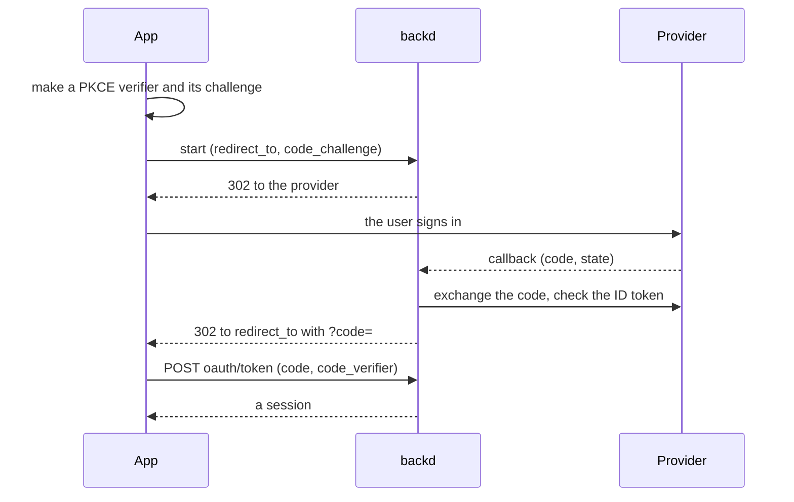

A realm can let its users sign in with **Google**, **Microsoft** or **Apple**. backd runs the redirect flow with the provider, checks the answer, finds or creates the user, and gives your app a one-time code to trade for a session. A user can have a password and any number of providers at once (at most one of each): they are [sign-in methods](../sessions/#sign-in-methods) of the same user, so roles, rules and owned documents don't depend on how the user signed in.


The provider flows described here are the **redirect** sign-in. Sign-in with the ID token a mobile app already holds, Apple's token revocation when an account is deleted, the profile handed to the app, `account.on_signup`, provider calls in the JavaScript client and other OpenID Connect providers are **planned**, each in its own step.


## Set it up

1. **Register an application** in each provider's console. The callback (redirect) address to register is
   `{BACKD_URL}/v1/{realm}/_auth/oauth/{provider}/callback`, for example `https://api.acme.example/v1/acme/_auth/oauth/google/callback`. The realm's `email.public_url` replaces `BACKD_URL` when it is set. `backd` logs this address for every provider at startup.
2. **Store the secrets** as realm secrets, never in `realm.yaml`: `backd secret set --realm acme GOOGLE_CLIENT_SECRET` (the instance needs `BACKD_SECRETS_KEY`).
3. **Declare the providers** in `realm.yaml`, and the apps a sign-in may send the user back to:

```yaml
sign_in:
  allowed_redirects: [https://app.acme.example, "acme://"]
providers:
  google:
    client_id: 1234.apps.googleusercontent.com
    client_secret: secret:GOOGLE_CLIENT_SECRET
  microsoft:
    client_id: 00000000-0000-0000-0000-000000000000
    client_secret: secret:MICROSOFT_CLIENT_SECRET
    tenant: common            # common | organizations | consumers | <tenant id>
  apple:
    services_id: com.acme.web
    team_id: ABCDE12345
    key_id: XYZ9876543
    private_key: secret:APPLE_SIGN_IN_KEY     # the whole .p8 file
```

`backd template realm` writes this section commented, with where to find each value. The keys:

| Key | Meaning |
|---|---|
| `sign_in.allowed_redirects` | Origins (`https://app.acme.example`, no path) and app schemes (`acme://`) a sign-in may send the user back to. Without it, `email.allowed_redirects` is used. A realm with providers needs one of the two |
| `providers.google.client_id`, `client_secret` | The OAuth client (type *Web application*) and the secret that holds its secret |
| `providers.google.native_client_ids` | Optional: the client ids of your mobile apps (for the planned ID-token sign-in) |
| `providers.microsoft.client_id`, `client_secret`, `tenant` | The application (client) id, its secret, and which accounts are accepted: `common` (any), `organizations` (work and school), `consumers` (personal) or one tenant id |
| `providers.apple.services_id`, `team_id`, `key_id`, `private_key` | The Services ID (web client id), the team and key that sign Apple's client secret, and the secret that holds the key. backd signs and renews the client secret itself |
| `providers.apple.bundle_ids`, `revoke_on_delete` | Optional: your iOS apps, and whether Apple tokens are revoked when an account is deleted (planned) |

`google`, `microsoft` and `apple` are reserved names; any other name is not a provider yet. A provider whose secret is not set answers `503 provider_unavailable`, and `backd` warns about it at startup. A realm with providers needs `BACKD_URL` (or `email.public_url`): startup refuses without it.

## The flow



1. The app makes a random PKCE **verifier** and its S256 **challenge**, and sends the browser to `GET /v1/{realm}/_auth/oauth/{provider}/start?redirect_to=…&code_challenge=…` (or calls `POST` and navigates to the `authorize_url` it returns). `redirect_to` must be within the allowed redirects.
2. The user signs in at the provider, which sends them to backd's callback. backd checks the `state` (good for one use, ten minutes), exchanges the code for an ID token with the provider, and verifies its signature, issuer, audience, expiry and nonce.
3. backd sends the browser to `redirect_to` with `?code=…` (a one-time login code, valid a minute) or `?error=…`.
4. The app redeems it: `POST /v1/{realm}/_auth/oauth/token` with `{"code", "code_verifier"}`. The answer is a session, like a login's (`{"cookie": true}` works too). The code is used up even when the verifier is wrong, so a stolen code is useless without the verifier only your app holds.

**A session never appears in a URL**: only the short-lived code does.

## Who the person is

| Situation | Result |
|---|---|
| The provider account is already linked | Signs in as that user. The identity's address is updated; the user's own never is |
| Its address matches an account, the provider is **Google or Apple**, says the address is verified, and the backd account's is verified too | Linked automatically, signed in |
| Its address matches an account and any of those is not true | `error=account_exists`: sign in another way and link explicitly |
| No account has the address | A user is created if the realm's `signup` allows it |

- **Microsoft never links by address.** The address in a Microsoft token is whatever the tenant's administrator set, so it can't prove who the person is; the user is stored unverified and email verification applies.
- **Pre-hijacking is closed:** an account made with someone's address, never verified, does not absorb that person's Google identity.
- **Sign-up modes** apply: `open`; `invite` needs the invitation token passed to `start` (`invitation=…`, bound to an address it must match); `closed` is `error=signup_closed`.
- New users from Google or Apple with a verified address are marked verified; an Apple private-relay address counts. A user needs an address: a provider that gives none ends with `error=email_required`.
- **Linking a provider to a signed-in user** is `POST …/start` with the session in `Authorization` and `"intent": "link"`; it ends at `redirect_to?linked=<provider>`. A provider account that belongs to another user, or a second one of the same provider, is `link_conflict`.
- Remove a method with `DELETE /_auth/identities/{provider}`; the last one can't be removed.

## Errors

A failed attempt goes back to your app as `redirect_to?error=<code>`, with nothing sensitive in it:

| `error` | Meaning |
|---|---|
| `cancelled` | The user refused at the provider |
| `account_exists` | An account has the address and can't be linked automatically (with `provider`) |
| `signup_closed`, `invitation_invalid` | Sign-up is closed, or needs a valid invitation |
| `link_conflict` | The provider account belongs to another user, or the user has one of this provider already |
| `email_not_verified` | The realm requires a verified address and the account's isn't |
| `email_required` | The provider gave no address |
| `signin_refused` | The account can't sign in (disabled, or from this network); the real reason is only in the [audit](../audit/) as `identity.signin_refused` |
| `provider_error` | The provider failed or answered something backd can't accept |

An attempt backd can't trace to an app (an unknown, used or expired `state`) can't be sent anywhere: the user sees the realm's `pages/oauth-error/<locale>.html` page, or a built-in English one, with `400`. The page is written by `backd template realm`.

## Security

- `state` is random, stored hashed, single use and short-lived, and bound to the provider. The nonce is checked in every ID token.
- PKCE protects the exchange with the provider (Google and Microsoft) and, always, the handover to your app.
- The ID token's signature is checked against the provider's published keys (cached, refetched at most once a minute); issuer, audience and expiry are enforced; for Microsoft the issuer must be the token's own tenant, restricted by `tenant`.
- backd reaches providers through a client that dials only the provider's hosts, resolves them itself and refuses private, loopback and link-local addresses, so a misconfiguration can't make it reach inside your network.
- `start`, `token` and the other new endpoints are limited to 30 a minute per client address.
- Provider secrets live in the realm's encrypted store; backd keeps no provider tokens.
